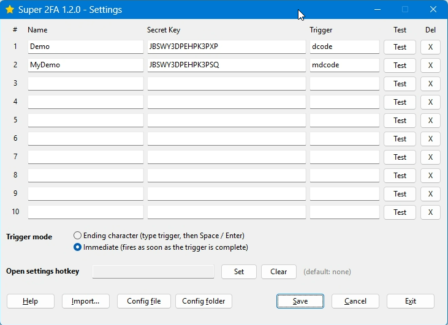

# Super 2FA

An AutoHotkey v2 utility that stores your TOTP secrets locally and inserts the
current 2FA code at the caret with a short typed trigger.

Type `2fagh` and the current 2FA code lands right where you are typing —
confirmed with a Space, or instantly the moment you finish typing, depending
on the trigger mode you pick. No phone, no authenticator app, no manual copy
and paste.

Runs in two modes:

- **Standalone** — a tray application you start directly.
- **Included** — a library merged into another AHK script via `#Include`,
  sharing that script's process and tray menu.

---

## Screenshot



The settings window: one row per account with its own **Test** button, the
global trigger-mode selector, the optional hotkey that opens the window, and
the Help / Import / Config file / Config folder / Save / Cancel / Exit actions.

---

## Requirements

- Windows
- AutoHotkey v2.0 or newer, installed at `C:\Program Files\AutoHotkey\v2`

Developed and tested against **AHK 2.0.19 (64-bit)**.

---

## Files

| File | Purpose |
|---|---|
| `super2fa.ahk` | The application. Standalone tray app *and* includable library. |
| `lib\totp.ahk` | TOTP / HMAC-SHA1 / SHA-1 / Base32 engine. Shared with the self test. |
| `selftest.ahk` | Verifies the crypto against published RFC test vectors. |
| `docs\settings.png` | Screenshot of the settings window shown above. |
| `super2fa.ini` | Your configuration - **not stored here**: it lives in `%APPDATA%\Super2FA\`, outside the project folder. |
| `selftest-report.txt` | Output of the last self test run. |

---

## Mode 1: standalone

Double-click `super2fa.ahk`, or use the command line:

```
"C:\Program Files\AutoHotkey\v2\AutoHotkey64.exe" super2fa.ahk
```

The program starts silently — there is no main window. Look for the shield icon
in the notification area (you may need to expand the hidden-icons tray).

A second launch detects the running copy (named mutex), shows a tray tip and
exits — no duplicate hotstrings, no double registration.

### Tray menu

| Item | Action |
|---|---|
| **Settings...** | Opens the configuration window. Also the default action on click. |
| **Test current code** | Shows the live code for every configured entry. |
| **Reload config** | Re-reads the INI file and re-registers all triggers. |
| **Help** | The same field reference shown by the Help button. |
| **Exit** | Quits and removes the tray icon. |

---

## Mode 2: included by a host script

Merge it into another script with `#Include` at global scope (not inside a
function):

```ahk
#Requires AutoHotkey v2.0
#SingleInstance Force        ; the host's own policy (place AFTER the include)

#Include e:\path\to\super2FA\super2fa.ahk   ; keep lib\ next to it

; ... host init ...

S2FA_Init()                  ; load config, register hotstrings
S2FA_AddTrayMenuItems()      ; optional: append a "Super 2FA" submenu
Hotkey("^!s", (*) => S2FA_ShowSettings())   ; any way to open settings
```

Detection is automatic: while the include's top-level code runs,
`A_LineFile` names `super2fa.ahk` while `A_ScriptFullPath` names the host, so
the standalone entry point skips itself. The host decides when to call
`S2FA_Init()`.

### Host-facing API

| Function | Action |
|---|---|
| `S2FA_Init()` | Load config, register hotstrings, start the keepalive timer. |
| `S2FA_ShowSettings()` | Open the settings window. |
| `S2FA_QuickPickTest()` | Dialog listing the current code per entry. |
| `S2FA_ShowHelp()` | The field reference. |
| `S2FA_ReloadConfig()` | Re-read the ini and re-register triggers. |
| `S2FA_AddTrayMenuItems()` | Append a "Super 2FA" submenu to the current tray menu without touching the host's own items. |
| `S2FA_Shutdown()` | Unregister all hotstrings/hotkeys, stop the timer. The host keeps running; a later `S2FA_Init()` re-enables everything. |

### Behaviour differences when included

- The tray menu and icon are **not** modified unless the host explicitly calls
  `S2FA_AddTrayMenuItems()`.
- The settings window has **no Exit button** (only Help / Save / Cancel),
  because exiting the process would kill the host.
- The configuration lives in `%APPDATA%\Super2FA\super2fa.ini` regardless of
  mode, so every host shares the same configuration and no secrets end up in
  any script folder.
- All application identifiers carry the `S2FA_` prefix, so a host cannot
  collide with them. The exception is `lib\totp.ahk`, which exposes the
  generic crypto names `TOTP`, `SHA1`, `HmacSha1`, `Base32Decode`,
  `Base32DecodedLength` and `SecondsRemaining` — a host defining its own
  functions under those names should include `lib\totp.ahk` alone instead.

### Host notes

- `#SingleInstance Ignore` inside this file silences AHK's built-in
  duplicate-launch prompt for both modes. A host that wants Force/Prompt
  behaviour should place its own `#SingleInstance` directive **after** the
  `#Include` (the last directive in the script wins).
- `S2FA_Init()` installs a keepalive timer, so including the file is enough to
  keep a host resident even if the host registers no other hooks.
- Two different host scripts including it at the same time would fight over
  the same triggers; run one at a time, or use different triggers per host.
- `lib\` must travel with `super2fa.ahk` — relative includes resolve next to
  the file that contains them.

---

## Configuring

Open **Settings** and fill in one row per account.

| Field | What to enter |
|---|---|
| **Name** | A label you recognise, e.g. `GitHub` or `AWS root`. Shown in dialogs and tray tips. |
| **Secret Key** | The Base32 shared secret — the value behind the QR code, **not** the 6-digit code. |
| **Trigger** | The text you type to insert a code. Letters and digits only, at least 3 characters. |

Each row has a **Test** button that computes the code on demand and reports how
long it stays valid, so you can compare it against your phone before saving.
The **X** button removes that row and shifts the rows below it up.

Click **Save** to write the configuration and activate the triggers.

### Importing entries from a file

The **Import...** button (next to Help) loads rows from any Super 2FA format
`.ini` file — the entry rows, the trigger mode and the settings hotkey.
Nothing is written or activated until you click **Save**, so an import is
reviewable and **Cancel** still discards it.

Typical use: moving entries to another machine. Copy the old machine's
`super2fa.ini` (in `%APPDATA%\Super2FA\`) somewhere reachable (USB stick,
network share), open Settings, click **Import...**, pick the file, review,
save. The form holds up to 10 entries; if the file contains more, only the
first 10 are imported and the dialog tells you so.

### Opening the configuration directly

The **Config file** and **Config folder** buttons open the live `super2fa.ini`
in your editor (or Explorer with it pre-selected). Handy for backups and
manual edits — use **Reload config** from the tray afterwards to pick up
manual changes.

### Where to find the Secret Key

In your provider's 2FA setup screen, look for a link such as *"enter this key
manually"* or *"can't scan the code?"*. It reveals a string like
`JBSWY3DPEHPK3PXP`. That string — not the rotating 6-digit number — is what
belongs in the Secret Key field.

Common secret lengths are 16, 26 or 32 characters.

### Trigger mode

A global setting, applied to every trigger.

- **Ending character** (default) — the code is inserted after you type the
  trigger *and* press Space, Enter or Tab. Recommended: it cannot fire while
  you are still typing a word.
- **Immediate** — the code is inserted the moment the last character of the
  trigger is typed. More convenient, but expands during normal typing whenever
  the trigger appears inside another word.

### Inserted-code notification

**Show a notification after inserting the code** is on by default: every
trigger pops a small bottom-right toast showing the code and how many seconds
it stays valid. Uncheck it if you would rather the code be inserted silently.
(This is the `ShowTrayTip` value in `[General]`.)

### Open settings hotkey

Optional. Click **Set**, then press the combination you want, e.g. `Ctrl+Alt+2`.
Press `Esc` to cancel. **Clear** removes it. Left empty by default, in which case
the settings window is only reachable from the tray menu (or the host API in
included mode).

---

## Using a trigger

1. Put the caret where the code should go.
2. Type the trigger, e.g. `2fagh`.
3. In *Ending character* mode, finish with Space / Enter / Tab. (*Immediate*
   mode needs no ending character — the code appears as soon as the trigger
   is complete.)

The code appears at the caret, replacing the trigger text. The ending
character is consumed — nothing extra is typed after the code. Your previous
clipboard contents are restored afterwards, so copying and pasting around a
trigger is safe.

---

## Configuration file

Settings live **outside the project folder**, in the per-user application data
directory:

```
%APPDATA%\Super2FA\super2fa.ini
```

Secrets therefore never sit inside a folder that might be published to git,
and on a multi-user machine every Windows account keeps its own entries. The
file is created on first save. A legacy `super2fa.ini` next to `super2fa.ahk`
(from an older install) is moved there automatically on first start.

Example:

```ini
[General]
Hotkey=^!2
TriggerMode=ending
ShowTrayTip=1

[Entries]
Count=2

[Entry1]
Name=GitHub
Secret=JBSWY3DPEHPK3PXP
Trigger=2fagh

[Entry2]
Name=AWS root
Secret=GEZDGNBVGY3TQOJQGEZDGNBVGY3TQOJQ
Trigger=aws2fa
```

Editing this file by hand works — use **Reload config** from the tray (or
`S2FA_ReloadConfig()`) to pick up the changes without restarting.

### Security note

Secrets are stored in **plain text** — this is what keeps the tool dependency-
free — so the INI file is as sensitive as the accounts it protects. It lives in
your per-user `%APPDATA%` directory, outside any repository, but anyone who can
read your Windows profile can read it. Set a Windows password, and do not copy
the file into synced or shared locations by hand.

---

## Self test

To confirm the crypto is working correctly:

```
"C:\Program Files\AutoHotkey\v2\AutoHotkey64.exe" selftest.ahk
```

Exit code `0` means everything passed. The results are written to
`selftest-report.txt`. The suite checks the implementation against
RFC 3174 (SHA-1), RFC 2202 (HMAC-SHA1), RFC 4648 (Base32) and every
RFC 6238 Appendix B TOTP vector.

---

## Releases (auto-built)

Pushing a tag like `v1.0.1`, or publishing a Release from the GitHub UI, runs
`.github/workflows/release.yml`. It installs AutoHotkey v2.0.19 on a Windows
runner, compiles `super2fa.ahk` with `Ahk2Exe` into `super2fa.exe`, and uploads
that executable as a downloadable asset on the Release — no manual build step
required.

---

## Troubleshooting

**Triggers do nothing.**
Check the three fields are filled in and that the trigger is at least 3 letters
or digits. Re-open Settings and press **Test** — if a code appears there, the
secret is fine and the problem is the trigger or the hotstring registration.
Try **Reload config** from the tray.

**The code is rejected by the site.**
Confirm your system clock is accurate — TOTP depends on it. A correct secret
with a skewed clock produces codes that are always invalid.

**"Invalid Base32 character" when testing.**
The secret contains characters outside the Base32 alphabet (`A`–`Z`, `2`–`7`).
Digits `0` and `1` are often confused with letters `O` and `I`; providers
normally avoid them, so re-read the value carefully.

**Typing the trigger inserts a code in the wrong place.**
Some applications do not accept a pasted value directly. If the caret is in a
field that blocks pasting, the code will not appear.

**The tray icon is missing.**
Windows hides new icons by default. Open the hidden-icons flyout and drag the
shield onto the visible area.

---

## Design notes

**The `#Include lib\totp.ahk` split** exists so `selftest.ahk` exercises exactly
the same code the application runs, rather than a copy that can drift out of
sync.

**SHA-1 and HMAC-SHA1 are implemented in pure AHK** rather than through
`bcrypt.dll` or CryptoAPI, so behaviour does not depend on the Windows build and
a compiled EXE needs no extra runtime support. Because `NumPut`/`NumGet` address
raw bytes, all big-endian fields (the SHA-1 message length and the TOTP counter)
are written byte by byte — writing them as `UInt` silently emits little-endian
bytes and produces wrong digests.

**Standalone single instance uses a named mutex** (`Local\Super2FA_SingleInstance`)
instead of the `#SingleInstance` directive, so the file can be included by a host
without imposing a duplicate-instance policy on it. `#SingleInstance Ignore` is
set to suppress v2's default Prompt dialog, which would otherwise appear before
any script code runs.

**Hotstring bookkeeping**: a dynamic hotstring can only be removed by passing the
exact option string it was registered with, and a mismatched attempt still
destroys the entry. Every registration therefore remembers its full
`options + trigger` key.

**A_LastError hygiene**: the single-instance check reads `A_LastError`
immediately after `CreateMutexW`. Any call that opens an existing file
(`FileAppend`, `IniRead`, ...) sets it to 183 (`ERROR_ALREADY_EXISTS`) again,
which would fake a duplicate hit.

**Keepalive timer**: a tray menu alone does not keep an AHK script resident —
with no hotkeys, hotstrings, timers or GUIs the process exits when startup
finishes. With an empty config that is exactly the state a first-time user is
in, so `S2FA_Init()` always installs an idle timer.

Defaults are SHA-1 / 6 digits / 30 seconds, which is what Google, Microsoft,
GitHub, AWS and virtually every other provider use.
